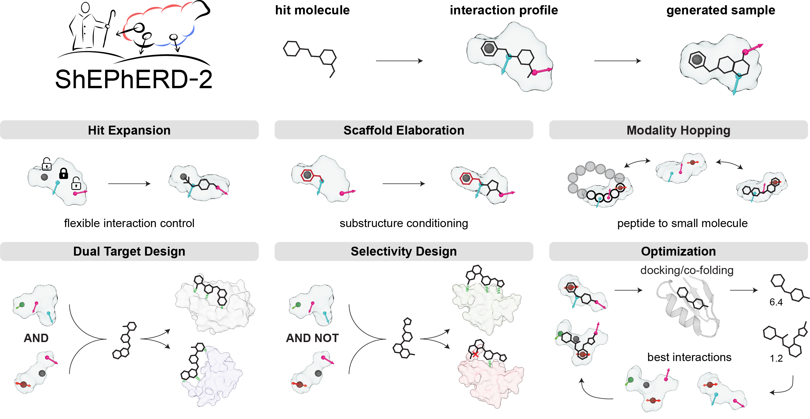

# *ShEPhERD-2*

This repository contains the code for *ShEPhERD-2*, a 3D molecular generative model that operates on an interaction profile composed of shape, electrostatics, and pharmacophores.

*ShEPhERD-2* samples diverse molecular structures conditioned on specified interaction profiles, and introduces precise control through pharmacophore prioritization, substructure constraints, and composition of multiple interaction profiles. These features enable bioisosteric fragment merging, dual-target design, selectivity engineering, and modality hopping.



<sup>**ShEPhERD**: **S**hape, **E**lectrostatics, and **Ph**armacophores **E**xplicit **R**epresentation **D**iffusion</sup>


## Table of Contents
1. [Installation](#installation)
2. [Quick start](#quick-start)
   - [CLI](#cli)
   - [Python](#python)
3. [Training and inference data](#training-and-inference-data)
4. [Training](#training)
5. [Inference](#inference)
6. [Evaluations](#evaluations)


## Installation

We suggest using a conda environment as shown below, or using `uv sync --extra cu[version]` and using a GFN2-xTB on your `PATH` built from source.

```bash
git clone https://github.com/coleygroup/shepherd2.git
cd shepherd2

conda create -n shepherd2 python==3.11 conda-forge::xtb
conda activate shepherd2
# GPU: replace <version> with 118, 124, 126, 128, or 130
uv pip install -e .[cu<version>]
```

For development and testing, we used PyTorch 2.6 with CUDA 12.4. Selecting CUDA > 12.4 pulls the x86_64-specific PyTorch wheels; on aarch64, install PyTorch and the PyTorch Geometric packages from ARM-compatible wheels instead.

xTB is required and is not pip-installable. If you run into issues with the conda-installed version, try installing it from [source](https://xtb-docs.readthedocs.io/en/latest/setup.html) and putting `xtb` on your `PATH`.


## Quick start

Here, we demonstrate the most straightforward application of interaction-conditioned generation with ShEPhERD-2. Full tutorials can be found in [examples/tutorials](examples/tutorials/).

The trained weights are hosted on [Hugging Face](https://huggingface.co/kabeywar/shepherd2) and are downloaded automatically on first use.

### CLI

```bash
# Recommended: from supplied 3D structures
python generate.py --sdf refs.sdf --output-dir outputs/refs

# Alternatively, from SMILES
python generate.py --smiles "Cc1cnc(N[CH]c2ccc(C)c(F)c2)s1" --output-dir outputs/test
```

See [Inference](#inference) for input formats, output files, and the most important options.

### Python

```python
from shepherd import load_model
from shepherd.interaction_profile import extract_interaction_profile
from shepherd.extract import mol_charges_from_samples
from shepherd_score.conformer_generation import embed_conformer_from_smiles

model = load_model() # Load model

# Interaction-conditioned generation from a reference molecule (shape + ESP + pharmacophores)
# RDKit Mol with a 3D conformer and explicit H
ref_mol = embed_conformer_from_smiles('Cc1cnc(N[CH]c2ccc(C)c(F)c2)s1', random_seed=0)
ref_profile = extract_interaction_profile(ref_mol)
samples = model.generate(
    batch_size=24,
    N_x1=ref_profile.n_atoms,
    N_x4=ref_profile.n_pharms,
    condition=ref_profile,
)
```

For multi-GPU inference, call `model.generate_distributed(...)` or `model.generate_composition_distributed(...)` inside an `if __name__ == "__main__":` block. The total batch is divided across the selected GPUs, and the guard prevents workers from launching more workers.

Convert the samples to RDKit `Mol` objects. By default, we relax all samples with xTB after inferring the charge from the original molecular graph.

```python
results = mol_charges_from_samples(samples, num_workers=20) # list of (mol, charges)
valid_mols = [mol for mol, charges in results if mol is not None]

# Or directly extract an interaction profile from a generated sample
profile = samples[0].to_interaction_profile()
```

## Training and inference data
`data/conformers/` contains the relevant 3D structures, scaffold indices, and pharmacophore prioritization masks used for model evaluation and case studies. Generally, 3D molecular structures are stored as pickle files containing a list of tuples of (molblock, partial charges).

The training data formatted as `.h5` files can be accessed on Zenodo.

## Training

`training/train.py` is our main training script. It can be run from the command line by specifying a parameter file and a seed. Training parameters are in `training/parameters/base.yaml`; adjust the batch size and `num_gpus` accordingly. Set `data_dir` in the parameter file, or provide it on the command line:

```bash
python -u training/train.py base.yaml 0 --data-dir /path/to/hdf5-files
```

Checkpoints are saved under `jobs/<output_dir>`, as configured by `training.output_dir`. If `last.ckpt` already exists there, the script creates a timestamped backup (`last.backup-<timestamp>.ckpt`) and automatically resumes training from `last.ckpt`. Remove or rename `last.ckpt` to start a fresh run.

## Inference

We provide a simple CLI for interaction-conditioned generation. See our [examples](examples/) for more detailed workflows and the scripts used in our experiments.

Generate molecules conditioned on a reference's shape, electrostatics (ESP), and pharmacophores. Choose one input: `--sdf` (preferred), `--molblock-charges` (a pickle of `(molblock, partial charges)` pairs, as under `data/conformers/`), `--smiles`, or `--smiles-file` (one SMILES per line) and supply `--output-dir`. SMILES are embedded and xTB-relaxed; SDF poses are preserved by default and optionally relaxed. Valid molecules are saved to `<output-dir>/results/reference_NNN/molecules.sdf`.

Key options (see `python generate.py --help` for all options):

| Option | Description |
|---|---|
| **Conditioning** | |
| `--condition all\|shape\|esp\|pharm` | Repeat to combine; default `all`. |
| `--scaffold-atoms JSON` | Atom indices to fix during generation (`--sdf` or `--molblock-charges` only). |
| `--pharm-mode MODE` | `pharm-full`: fix all; `pharm-priority`: fix selected, inpaint rest; `pharm-priority-only`: fix selected and drop rest. |
| `--pharm-atoms JSON`, `--pharm-masks JSON` | Specifies priority pharmacophores (`--sdf` or `--molblock-charges` only; required for `pharm-priority`). |
| `--condition-com origin\|auto` | Frame the condition is generated in. `origin` (default, recommended) uses the reference molecule's frame; `auto` centers generation on the scaffold/pharmacophore condition. |
| **Sampling** | |
| `--indices N [N ...]` | Input positions to run (default all). Output is laid out by input position, so several shards can share one `--output-dir`. |
| `--n-samples N` | Samples per reference (default 20). |
| `--batch-size N` | Samples per model call (default `min(50, n_samples)`). |
| `--add-atoms N`, `--add-pharms N` | Diffuse extra atom/pharmacophores relative to the reference (default 0). |
| `--add-atoms-range MIN MAX`, `--add-pharms-range MIN MAX` | Uniformly sample added atoms/pharmacophores per molecule from inclusive `[MIN, MAX]` (accepts negatives). |
| **Relaxation and evaluation** | |
| `--relax-references` | xTB-relax 3D references; charges are recomputed from the relaxed pose, discarding any supplied by `--molblock-charges`. |
| `--neutralize-esp` | Neutralize conditioning ESP. |
| `--sample-xtb relax\|charges\|none` | xTB spent on each generated sample: `relax` (default) geometry-optimizes, `charges` keeps only single-point charges, `none` converts geometries only. Ignored with `--evaluate`. |
| `--evaluate` | Run shepherd-score evaluation suite. |
| `--num-workers N` | xTB worker processes (default automatic). |
| `--parallel-over reference\|sample` | Spend `--num-workers` on whole references in parallel (default) or on the samples of one reference at a time. |
| **Run settings** | |
| `--checkpoint PATH`, `--device cpu\|cuda` | Override downloaded checkpoint or automatic device choice. |
| `--seed N` | Embedding and sampling seed (default 1). |
| `--overwrite` | Regenerate existing results; otherwise resume. |

Atom-selection JSON uses zero-based atom indices based on the input record, including explicit hydrogens:
`[[1, 2, 3], [4, 5]]` in record order, or `{"0": [1, 2, 3]}` keyed by record index.
Pharmacophore/scaffold modes require `--sdf` or `--molblock-charges` input and pharmacophore conditioning.

### Choosing `batch_size`

`batch_size` should be tuned depending on the number of atoms in your system and your GPU. We recommend the H100 settings below as a starting point. See [GPU recommendations](docs/gpu_recommendations.md) for benchmarks and guidance for other GPUs.

| card | estimate | druglike (`N_x1` ~ 50)<br>bs (s/batch; s/mol) | large (~80)<br>bs (s/batch; s/mol) | extra large (~120)<br>bs [s/batch; s/mol] |
|---|---|---:|---:|---:|
| H100 (80 GB) | `10,000 / N_x1` | 192 [108; 0.56] | 96 [98; 1.02] | 96 [174; 1.81] |


## Evaluations

For MOSES evaluations, we use [shepherd-score](https://github.com/coleygroup/shepherd-score) by passing `model.to_shepherd_score_inputs(samples, condition=profile)` into the `ConditionalEvalPipeline`. We also use [MolGenBench](https://github.com/Intelligent-Drug-Discovery-Lab/MolGenBench/) for benchmarking against other models.

`examples/experiments/` also contains scripts that we used to run the experiments in our preprint. Some of the scripts (`examples/experiments/run_*.py`) take a few additional command-line arguments, which are detailed in those corresponding scripts by argparse commands.

## License

This project is licensed under the MIT License

## Citation

If you use or adapt *ShEPhERD-2* or [shepherd-score](https://github.com/coleygroup/shepherd-score) in your work, please cite us:

```bibtex
@inproceedings{
adams2025shepherd,
title={Sh{EP}h{ERD}: Diffusing shape, electrostatics, and pharmacophores for bioisosteric drug design},
author={Keir Adams and Kento Abeywardane and Jenna Fromer and Connor W. Coley},
booktitle={The Thirteenth International Conference on Learning Representations},
year={2025},
url={https://openreview.net/forum?id=KSLkFYHlYg}
}
```
